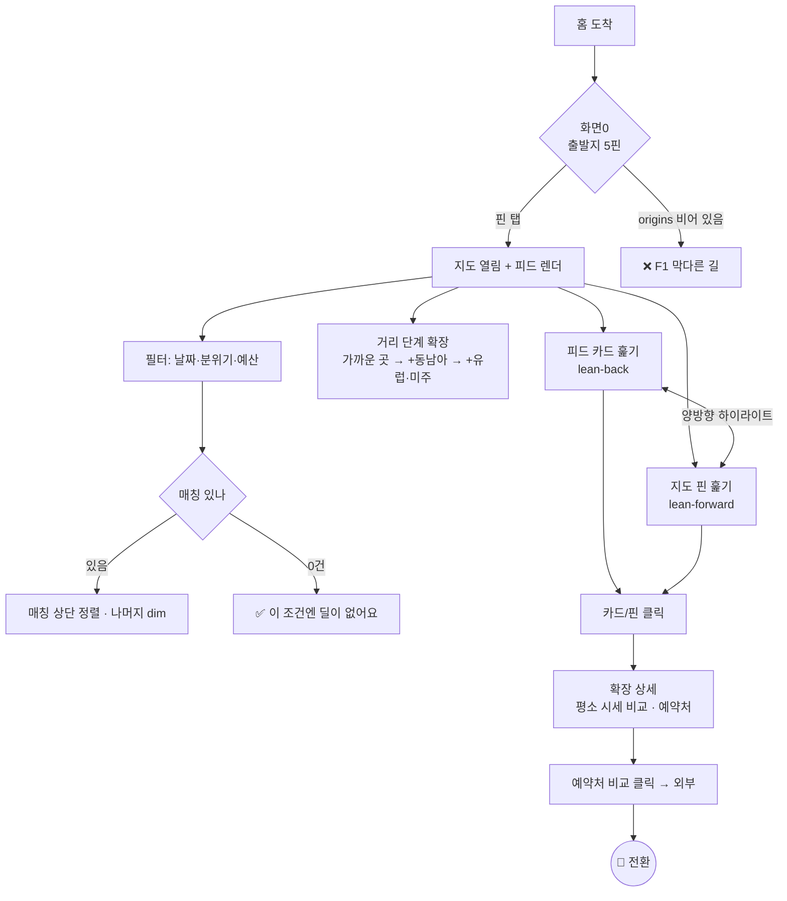
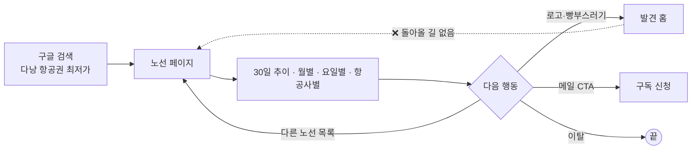

# FLOWS.md — 유저 플로우 (경로 · 분기 · 실패)

> **소유: 기획 세션.** 2026-08-22 작성 — 실제 구현을 읽고 기록했다.
> 페이지 구조는 `IA.md`, 화면별 확정 스펙은 `SPEC.md`, 문구는 `COPY.md`.

## 왜 이 문서가 있나

플로우를 그리는 목적은 예쁜 다이어그램이 아니라 **§4의 실패 목록을 뽑아내는 것**이다.
행복한 경로는 누구나 만든다. 빠지는 건 항상 막다른 길이고, 그건 플로우를 끝까지 그려야 보인다.
실제로 이 문서를 쓰면서 **문서에만 있고 구현에 없는 빈 상태**와 **완전한 막다른 길**을 찾았다(§4 F1).

## 1. 핵심 과업 (사용자가 여기 오는 이유)

| # | 과업 | 사용자 상태 | 진입 | 성공 |
|---|---|---|---|---|
| **T1** | **"시간·돈 되는데 어디 갈까"에 답 얻기** | 목적지 **없음** | 홈 | 몰랐던 목적지를 발견 |
| **T2** | 그 목적지가 진짜 싼지 확인하고 예약하러 가기 | 후보 1곳 있음 | 홈 (확장 상세) | 예약처 비교 클릭 = **제휴 전환** |
| **T3** | 정해둔 노선의 시세·시기 파악 | 목적지 **있음** | 검색 → 노선 페이지 | 시세 확인 → 홈 유입 or 구독 |

- **T1이 제품의 존재 이유**다(destination-last). T3는 SEO 미끼이자 신뢰 증거고, 목적지가 이미 있는
  사람을 받는 **반대 방향** 과업이다. 둘을 섞어 설계하면 홈이 검색 UI가 된다(`DECISIONS.md` 2026-08-01).

## 2. 플로우 T1 — 첫 방문에서 목적지 발견

**분기 설계 의도**
- **피드(lean-back)와 지도(lean-forward)를 동시에 둔 건 의도다.** 지도만 두면 결국 사용자가
  출발지·목적지를 고르는 "검색"이 되고, 타깃("정해줘")이 이탈한다(`DECISIONS.md`).
- **필터를 켜면 거리 단계를 무시하고 전 지역에서 찾는다.** "해변"을 찾는 사람에게 "가까운 곳" 제약은 무의미하다.
- **필터는 숨김이 아니라 흐림(dim)** — 지도의 밀도·맥락을 유지하기 위해서다.

## 3. 플로우 T3 — 검색 유입

- 노선 페이지 → 홈은 **로고·빵부스러기 두 곳**으로 열려 있다.
- 반대 방향(홈 → 노선)은 **막혀 있다**(`IA.md` 구멍 A). 그래서 T3 유입자를 T1으로 넘길 수는 있어도,
  T1 사용자에게 "이 노선 시세 근거"를 보여줄 수 없다. **일방통행이다.**

## 4. 실패 · 막다른 길 전수

> 이 표가 이 문서의 본체다. `SPEC.md`의 상태 인벤토리와 프론트 QA 체크리스트의 근거가 된다.

| # | 상황 | 언제 | 현재 동작 | 스펙 | 담당 |
|---|---|---|---|---|---|
| **F1** | **`origins`가 빈 객체** (그날 딜 0건) | 수집 실패·전량 만료 | ❌ **화면0에 핀 0개 + 안내 없음 = 아무것도 못 함.** 빈 상태 문구 **"오늘은 조용하네요"**(2026-08-01 방향)는 **구현에 없다**(검증: 0건). 확정은 `COPY.md` C-1 | 문구만 있음 | **PH3** |
| **F2** | 출발지 딜이 아주 적음 | 대구 7건 · 제주 8건 (서울 57건) | 피드가 짧고 지도가 휑함. 별도 처리 없음 | ❌ 없음 | **PH3** |
| F3 | 필터 매칭 0건 | 조건 과다 | ✅ "이 조건엔 딜이 없어요 — 조건을 바꿔보세요" | ✅ | — |
| **F4** | `links`가 빈 배열 | 백엔드가 링크 생성 실패 | 비교 패널은 안 그려지나 **"어디가 제일 싼지 비교해보세요" 헤더만 남는다** | ❌ 없음 | **PH4** |
| **F5** | 공유 링크의 딜이 오늘 없음 | 딜은 매일 바뀜 | 딥링크가 없어 아직 발생 안 함. **IA-2 도입 시 필수** | 방향만 | **PH4** |
| F6 | JS 꺼짐 | 드묾 | ✅ `<noscript>` — 최저가 30건 + 노선 26 링크 (지도는 없음) | ✅ | — |
| **F7** | 새로고침 / 뒤로가기 | 흔함 | ❌ 출발지 초기화. 뒤로가기는 사이트 이탈 | ❌ `IA.md` IA-2 | **PH4** |
| **F8** | 모바일에서 카드 미리보기 | 터치 기기 | ❌ hover가 `mouseenter`라 컴팩트 단계가 없고 탭하면 바로 확장 (B10) | 스펙과 어긋남 | **PH5** |
| **F9** | 키보드만 사용 | 접근성 | ❌ `tabindex`·`role`·키 핸들러·포커스 없음 = 조작 불가 (B11) | ❌ 없음 | **PH6** |
| F10 | 확장 상세 열린 채 정렬·단계·필터 변경 | 흔함 | ✅ `collapse()` 호출됨 | ✅ | — |
| **F11** | 191만원 딜을 예산 슬라이더로 되살리기 | 상한 100만 < 최고가 191만 | ❌ 걸러낼 수만 있고 되살릴 수 없음 (B5) | ❌ 없음 | **PH2** |
| **F12** | 필터를 켜면 지도가 무너짐 | 전 지역 매칭 | ❌ minor 포함 전 도시(서울 57곳)가 한꺼번에 찍힘 (B6) | 부작용 미정 | **PH2** |
| **F15** | **피드에 있는 딜이 지도에 없다** | `＋유럽·미주` 단계 | ❌ LA·호놀룰루가 피드엔 있는데 far 뷰 밖이라 핀이 없다. 목록과 지도가 어긋남 (B14) | ❌ 없음 | **PH1** |
| F13 | 사진 없음 | 전 목적지 | 태그 그라디언트 + "사진 준비중" (B12) | 정책만 | PH6 |
| F14 | 느린 회선 | 모바일 | `index.html` 278KB (인라인 때문, B13) | ❌ 예산 없음 | PH6 |

**굵은 항목 = 스펙이 없어서 프론트가 임의로 처리하게 되는 것.** 각 PH에서 반드시 정한다.

### F15는 발견 서비스의 기본 약속을 깬다
`＋유럽·미주`를 눌렀는데 피드에는 로스앤젤레스(₩834,396)·호놀룰루(₩735,534)가 있고 **지도에는 그 핀이 없다.**
목록과 지도가 어긋나면 사용자는 둘 중 하나를 못 믿게 되고, 우리가 파는 건 신뢰다.
원인은 라벨 겹침이 아니라 **투영 범위**이며(`SPEC.md` §CH1 B14), 값 튜닝으로는 못 고친다.

> **원칙: 피드에 있는 딜은 지도에서 찾을 수 있어야 한다.**
> 화면 밖 딜이 불가피하다면 그 사실을 알려야 한다.

### F1이 가장 급하다
딜 0건은 "언젠가 있을 법한 일"이 아니다. 수집은 외부 API에 의존하고(`fetch_breadth`), 토큰 만료·API 장애·
`dests` 필터 강화 어느 것 하나로도 발생한다. 그날 방문자는 **빈 한국 지도만 보고 나간다.**
`CONTRACT.md`도 "데이터 0건인 날도 형태는 유지된다"고 보장하고 있으므로 **화면 쪽 대응만 빠진 상태**다.

## 5. 이 플로우에서 나온 상태 목록

`SPEC.md` 상태 인벤토리로 이관한다.

| 화면 | 상태 |
|---|---|
| 화면0 (출발지) | 정상 · **딜 0건** · 재진입(pill 클릭) |
| 카드 피드 | 정상 · **딜 희소(<10건)** · 필터 매칭 0건 · 정렬 3종 · hero 유무 |
| 지도 무대 | 거리 단계 3종 · LOD(major/minor) · 필터 dim · **필터 시 과밀** · 활성 핀 |
| 플로팅 카드 | 컴팩트 · 확장 · **모바일(컴팩트 단계 없음)** · **links 0건** |
| 전역 | JS 없음 · **새로고침/뒤로가기** · **키보드** · 느린 회선 |

## 6. 미결

| # | 안건 | 담당 |
|---|---|---|
| FL-1 | F1 딜 0건 화면 확정 (문구·재방문 유도·노선 페이지 안내) | PH3 |
| FL-2 | F2 딜 희소 출발지에서 피드·지도가 초라해 보이지 않게 | PH3 |
| FL-3 | F4 `links` 0건일 때 확장 상세 구성 | PH4 |
| FL-4 | F5 사라진 딜 딥링크 착지 화면 | PH4 |
| **FL-5** | **F15 피드↔지도 불일치 — 거리 단계 구성 재설계** | **PH1** |
