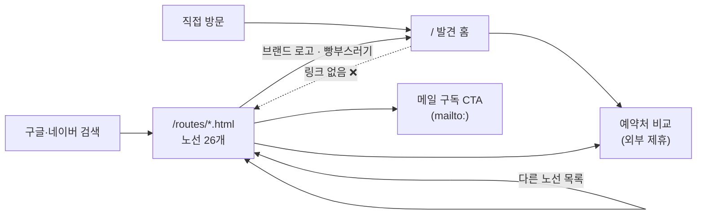

# IA.md — 정보구조 (사이트맵 · 페이지 역할 · URL · 네비)

> **소유: 기획 세션.** 2026-08-22 작성 — **실제 구현(`discover_home.py`·`discover.js`·`build_site.py`)을 읽고** 기록했다.
> 인터랙션 스펙은 `SPEC.md`, 유저 경로는 `FLOWS.md`, 왜는 `DECISIONS.md`.

## 1. 사이트맵

정적 사이트라 **페이지는 27개뿐**이고, 나머지는 전부 홈 안의 상태 변화다.

```
/                          발견 홈 (지도 + 카드 피드)          ← 제품의 본체
/routes/{ORIG}-{DEST}.html 노선별 최저가 분석 × 26            ← 검색 유입 담당
/sitemap.xml  /robots.txt  색인용
/data/deals.json           프론트 소비용 (사람이 보는 페이지 아님)
```



> **점선이 구멍이다.** 홈에서 노선 페이지로 가는 길이 없다 → §4.

## 2. 페이지 역할·책임

| 페이지 | 한 줄 역할 | 성공 = | 담당 세션 |
|---|---|---|---|
| **발견 홈** `/` | "어디 갈까"에 목적지를 **정해준다** | 예약처 비교 클릭(제휴 전환) | 프론트 |
| **노선 페이지** `/routes/{code}.html` | 검색으로 들어온 **목적지 확정형** 방문자에게 시세 근거를 준다 | 홈 유입 + 구독 신청 | 백엔드 |
| `sitemap.xml` / `robots.txt` | 색인 유도 | 26+1 URL 색인 | 백엔드 |

- **두 페이지는 반대 방향의 사용자를 받는다.** 홈은 목적지가 *없는* 사람(destination-last),
  노선 페이지는 목적지를 *이미 정한* 사람(destination-first)이다. 노선 페이지는 SEO 미끼이자
  "우리가 가격을 진짜 갖고 있다"는 신뢰 증거고, 거기서 홈으로 넘기는 게 설계 의도다.

## 3. URL 규칙

| 대상 | 형식 | 예 | 정하는 곳 |
|---|---|---|---|
| 홈 | `/` | | |
| 노선 | `/routes/{출발IATA}-{도착IATA}.html` | `/routes/ICN-DAD.html` | `config.ROUTES` (백엔드) |
| 절대 URL | `BASE_URL` 상수 | `https://ryu-tomi.github.io/promo-ticket-site` | `theme.py` |

- 노선 코드는 **실제 공항 코드**(`ICN`·`GMP`)다. 홈의 `SEL`(서울 통합 가상 허브)과 다르다 — `CONTRACT.md` 참조.
- 커스텀 도메인(`galmal.kr`) 도입 시 `BASE_URL` 한 곳만 바꾸면 된다. (백로그)

## 4. 네비게이션 모델 — 현재 상태와 구멍

### 헤더 (홈)
```
[갈래말래 로고]   발견(활성) · 노선별(비활성)   [○○ 출발 ▾]
```

### ❌ 구멍 A — 홈에서 노선 페이지로 갈 수 없다
`discover_home.py`의 네비는 `<span class="muted">노선별</span>` 로, **링크가 아니라 회색 텍스트다.**
노선 26개로 가는 링크는 `<noscript>` 블록 안에만 있다 — 즉 **JS가 켜진 정상 방문자는 도달할 수 없다.**

**왜 문제인가**
1. SEO: 내부 링크는 색인·랭킹 신호다. 홈에서 26페이지로 향하는 링크가 0이면 그 신호를 스스로 버린다.
2. 제품: 홈에서 "다낭" 딜을 본 사람이 **그 노선의 30일 시세**를 볼 방법이 없다.
   신뢰 근거(우리 차별점)를 만들어 두고 진입로를 막아 놓은 상태다.
3. 이메일 구독(§5)의 유일한 진입점이 노선 페이지인데, 그 페이지 자체가 홈에서 도달 불가다.

→ **미결 IA-1.** 담당 **PH6 / CH6**(마감·SEO).

### ❌ 구멍 B — URL에 상태가 전혀 없다
`discover.js`에 `location`·`history`·`hashchange`·`localStorage`가 **한 번도 등장하지 않는다**(검증: 0건).
따라서:

| 하고 싶은 것 | 현재 |
|---|---|
| 새로고침 후 이어보기 | ❌ 출발지 선택 화면으로 되돌아감 |
| 친구에게 딜 공유 | ❌ 링크를 보내면 상대는 첫 화면부터 시작 |
| 카톡·커뮤니티 시딩 | ❌ 특정 딜을 가리킬 수 없음 |
| 뒤로가기로 상세 닫기 | ❌ 브라우저 뒤로가기 = 사이트 이탈 |

**왜 심각한가**: 발견 서비스에서 **공유는 바이럴의 유일한 경로**다. 백로그의 "커뮤니티 시딩(뽐뿌 등)"도
"오늘 다낭 21만원" 같은 **딜 하나를 가리키는 링크**가 있어야 성립한다. 지금은 홈 주소밖에 보낼 수 없다.

**방향 제안(미확정)** — 정적 사이트라 서버 리라이트가 없으므로 **해시**가 안전하다.

| 상태 | URL | 이유 |
|---|---|---|
| 출발지만 | `#SEL` | 새로고침·공유 시 출발지 유지 |
| 딜 상세 열림 | `#SEL-DAD` | 딜 하나를 가리키는 링크 |
| 필터·정렬·거리 단계 | **URL에 넣지 않음** | 공유받은 사람에게 남의 필터를 강요하게 됨. 휘발성 상태다 |

> ⚠️ 반드시 정의해야 할 상태: **딜은 매일 바뀐다.** 어제 공유한 `#SEL-DAD`가 오늘은 없는 딜일 수 있다.
> 이때의 화면(출발지만 적용 + 안내 문구)을 스펙에 넣지 않으면 프론트가 임의로 처리한다. → `SPEC.md`

→ **미결 IA-2.** 담당 **PH4 / CH4**(상세·전환).

### ⚠️ 구멍 C — 용어 불일치
노선 페이지 빵부스러기가 `특가 피드 › 동남아 › 서울 → 다낭` 인데, **"특가 피드"라는 화면은 IA에 없다.**
홈의 이름은 "발견"이고 "오늘의특가"는 중복이라 삭제된 개념이다(2026-08-01 확정, 현재는 이 문서 §2).
→ **미결 IA-3.** 담당 **PH6**, 문구는 `COPY.md`.

## 5. 이메일 구독의 실제 위치 (문서 오류 정정)

재편 전 `DESIGN.md`는 "알림(이메일 구독)은 나중(**미구현**) → 네비에서도 제외"라고 적고 있었으나 **사실과 달랐다.**

- 노선 페이지 26개에는 **`{노선} 특가 알림 받기` 섹션과 mailto CTA가 살아 있다**(`build_site.py:274`).
- 수집·판정·발송 파이프라인은 크론으로 **매일 실제 가동 중**이다(`subscriptions.py` / `send_alerts.py`).

정확한 서술은 **"구현되어 운영 중이나, 진입점이 노선 페이지에만 있고 발견 홈에는 없다"**이다.
"v2로 미룸"이 가리키는 건 **발견 홈에 구독 UI를 넣는 일**이지 기능 자체가 아니다.
→ `DESIGN.md` 수정 **완료**(PH0 / T6, 2026-08-22).

## 6. 콘텐츠 인벤토리

### 발견 홈 `/`
| 블록 | 내용 | 데이터 출처 |
|---|---|---|
| 헤더 | 로고 · 네비 · 출발지 pill | 정적 |
| 화면0 (intro) | 한국 지도 + 출발 공항 핀 | `deals.json > origins` (**딜이 있는 허브만**) |
| 카드 피드 | 오늘의 발견 · 정렬 토글 · 카드 N장 | `deals.json > deals` |
| 지도 무대 | 핀 · 항로 · 거리 단계 · 줌 | `deals.json` + `world.geojson`(50m) |
| 필터 도크 | 날짜 · 분위기 · 예산 | 정적 UI, 값은 딜에 적용 |
| 플로팅/확장 카드 | 가격 비교 · 예약처 링크 · 광고 고지 | `deals.json > links`, `median` |
| `<noscript>` | 최저가 30건 목록 + 노선 26 링크 | 빌드 시 서버사이드 렌더 |

- **데이터·지도는 HTML에 인라인된다**(`window.__DEALS` / `window.__WORLD`) → `file://`로도 열린다. 대신 `index.html`이 278KB. (B13)

### 노선 페이지 `/routes/{code}.html`
| 블록 | 데이터 출처 |
|---|---|
| 브랜드바 · 빵부스러기 | 정적 (§4 구멍 C) |
| hero: 최근 30일 최저가 · 평소 시세 · 언제 싼가 | `route_summary` |
| 최저가 추이 차트(30일) | `daily_min` |
| 출발 월별 / 요일별 최저가 | `month_min` / `weekday_min` |
| 항공사별 최저가 표 | `airline_min` |
| **특가 알림 받기 (mailto)** | 정적 + 노선 코드 |
| 다른 노선 목록 25개 | `config.ROUTES` |

## 7. 진입점별 첫 화면

| 진입 | 도착 | 첫 과업 | 비고 |
|---|---|---|---|
| 검색("다낭 항공권 최저가") | 노선 페이지 | 시세 확인 | SEO 담당. 홈 유도가 목표 |
| 직접 방문·북마크 | 홈 | **출발지 선택**(화면0) | 매번 다시 고름 — 구멍 B |
| 공유 링크 | 홈 | 출발지 선택 | 무엇을 공유받았는지 알 수 없음 — 구멍 B |
| 구독 알림 메일 | 예약처 or 노선 페이지 | — | v2 |

## 8. 미결 목록

| # | 안건 | 담당 | 상태 |
|---|---|---|---|
| IA-1 | 홈 → 노선 페이지 진입로 (네비 링크 + 딜↔노선 연결) | PH6 / CH6 | 미정 |
| IA-2 | URL 해시 상태 · 딜 딥링크 · 사라진 딜 처리 | PH4 / CH4 | 방향 제안됨 |
| IA-3 | 빵부스러기 "특가 피드" 용어 정리 | PH6 | 미정 |
| IA-4 | 커스텀 도메인 전환 시 `BASE_URL`·canonical 점검 | 백로그 | 미정 |
